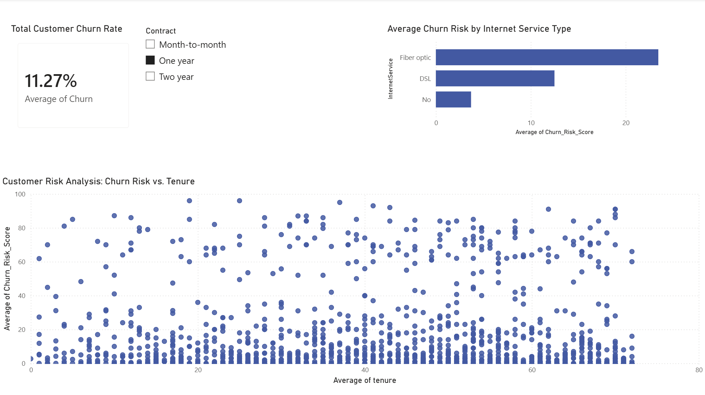

# Telecom Customer Churn Prediction Pipeline

An end-to-end data pipeline built to ingest customer data, predict churn risk using machine learning, and deliver executive-level business insights.

## 🛠️ Tech Stack & Workflow
* **Database:** SQLite for initial data parsing and storage.
* **Machine Learning:** Python, Pandas, and Scikit-Learn. Trained a `RandomForestClassifier` yielding **75.59% accuracy**.
* **Business Intelligence:** Power BI for dynamic visualization of `Churn_Risk_Score` probabilities.

---

## 📊 Dashboard Preview



---

## 📈 Key Business Insights 
1. **The Onboarding Crisis:** The scatter plot reveals a massive cluster of high-risk customers concentrated entirely in their **first 1 to 5 months**.
2. **Contract Volatility:** Month-to-month accounts hold an emergency-level churn rate, whereas 2-year contracts successfully flatten risk across all tenures.
3. **Product Fragility:** Despite being a premium product, **Fiber Optic** customers carry a significantly higher churn risk than DSL customers, suggesting potential pricing or technical friction.

---

## 🚀 How to Run This Project

1. **Clone this repository:**
   ```bash
   git clone [https://github.com/your-username/telecom-customer-churn-prediction.git](https://github.com/your-username/telecom-customer-churn-prediction.git)
2. pip install -r requirements.txt   
